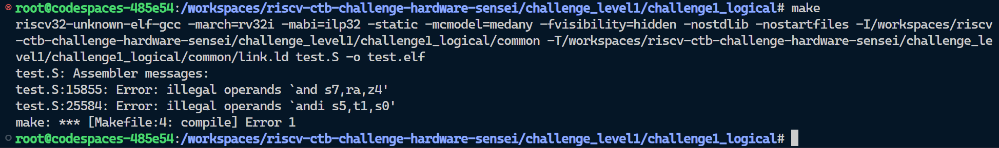
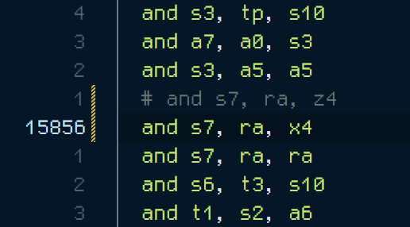
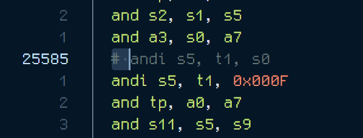
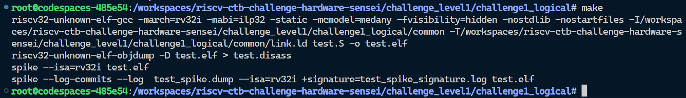

## Level 1 - Challenge 1 - Logical

In this challenge, i found two RISC-V assembly instructions that contain illegal operands as shown in this screenshot.

### Instruction 1: `and s7, ra, z4`

**Issue:** The instruction attempts to use `z4` as an operand, which is not a valid register in the RISC-V ISA.

**Description:** The `and` instruction is used for bitwise AND operations. However, it requires valid registers as operands, and `z4` is not a recognized register in the RISC-V architecture.

**Fix:** To resolve this issue, we should use a valid register as the third operand. For example, let's use `x4` instead of `z4`:

**Fixed Instruction:** `and s7, ra, x4`

### Instruction 2: `andi s5, t1, s0`

**Issue:** The instruction attempts to use `s0` as an immediate value, which is not allowed for the `andi` instruction.

**Description:** The `andi` instruction is used for bitwise AND operations with an immediate value. It requires a valid immediate value to perform the operation, but in this case, `s0` is being used as the immediate value, which is not valid.

**Fix:** To resolve this issue, we should replace `s0` with a valid 32-bit immediate value.

**Fixed Instruction:** `andi s5, t1, 0x000F` (This example uses `0x000F` as the immediate value, but you can choose any valid 32-bit immediate value based on your specific requirement).

Finally the build concluded without any errors.

