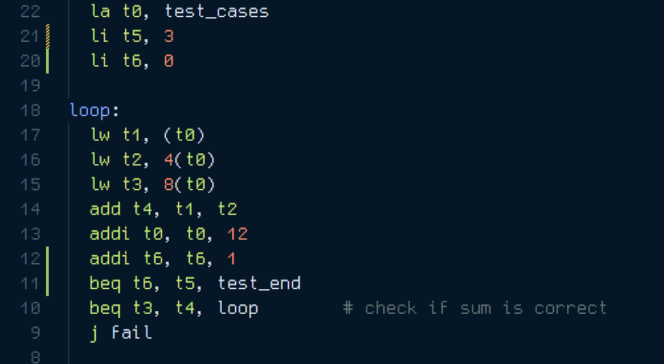

## Level 1 - Challenge 2 - Loop

In this challenge, the loop is running indefinitely as shown in this screenshot, i had to `Ctrl + C` -> `Q` -> `Return` to stop execution.

### Reason for infinite loop

**Issue:** The loop takes 2 elements from `test_cases` array computes their sum and compares it to 3rd element. After this takes next two elements and does the same. The consdition for exiting loop is if the sum comparison is not satisfied. Hence the loop keeps running even after the test case is exhausted (i guess it keeps mathcing sums of 0 to 0)

**Fix:** Register `t5` is already set to value 3. This is also the number of times the loop should run, in `test_cases` array 3 triplets of numbers exist. We initialize `t6` register to 0 and increment by 1 in every iteraion. When `t5` equals `t6` we jump to `test_end`.

Finally the build concluded without any errors.

