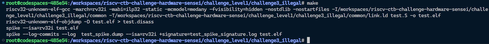

## Level 1 - Challenge 3 - Illegal

In this challenge, the program keeps jump into exception handler as shown in this screenshot, i had to `Ctrl + C` -> `Q` -> `Return` to stop execution.

### Reason for getting stuck in handler

**Issue:** The return address of `mret` is always `mepc` which is the address of instruction causing the trap, this leads to program getting stuck in exception handler.

**Fix:** Ideally the Program Counter should be pointed to the instruction right after the one causing the trap. But here that instruction itself is a jump to fail. So we move 2 instructions ahead of the one causing the trap, to avoid getting FAILED message. Since the size of an instruction is 4 bytes, to move by two instructions, we increment `mepc` by 8.

Finally the build concluded without any errors.

