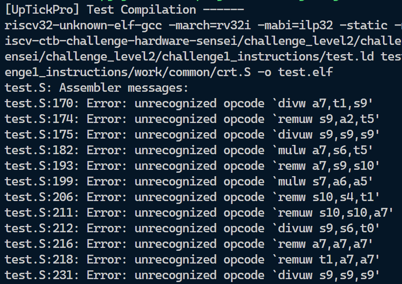
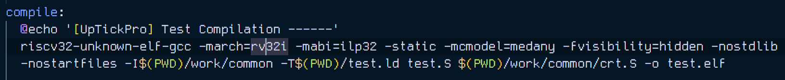
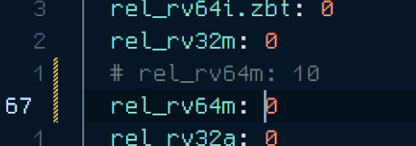
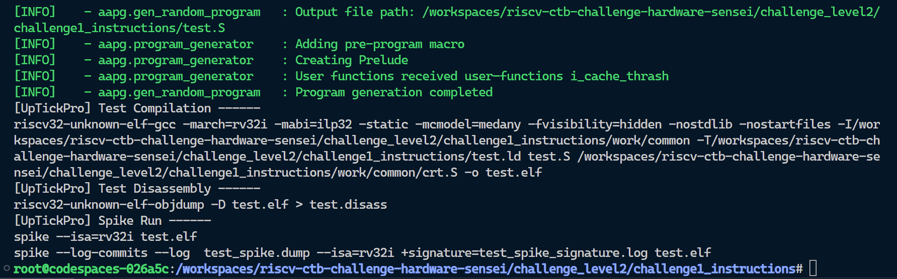

## Level 2 - Challenge 1 - Instructions

In this challenge, AAPG (Automated Assembly Program Generation) tool is used to create and compile an assembly program as shown in this screenshot, a lot of errors are encountered while compilation phase of build.

All errors have the same message `unrecognized opcode`

### Observations

- When we look at the `Makefile` as shown below, the AAPG generates architecture for `rv32`. It doesn't signify which flavor of `rv32` is being generated. That is configured through the `yaml`.

- But if we look at the compile phase, the `march` is set to `rv32i` meaning multiplication and division instructions are not supported.
- There are 5 opcodes that are repeated in all these errors :- `mulw`, `divw`, `divuw`, `remw` & `remuw`.
- In the `yaml` config file, we have a isa instruction distribution. Upon closer inspection it is revealed that `rv64m` is set to `10`.

### Deduction

- Since errors arise from Multiplication and division operations (and remainder operation which is also similar to division), i disabled `rv64m` in the config by setting it to `0`.

My hunch worked and the build seems to have concluded without any errors.

