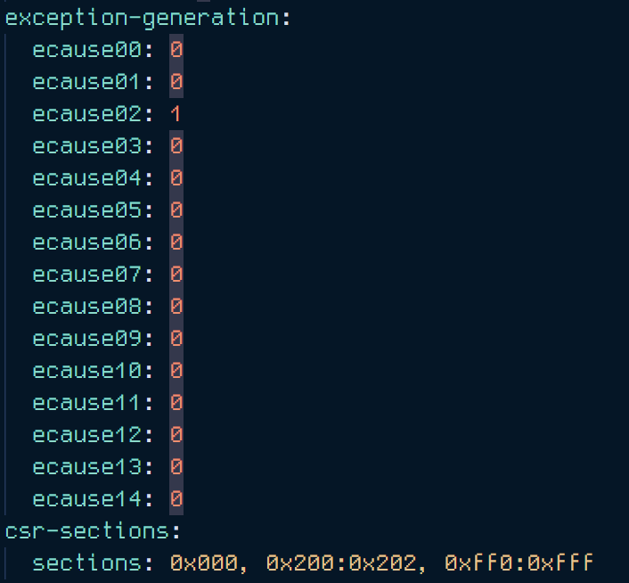
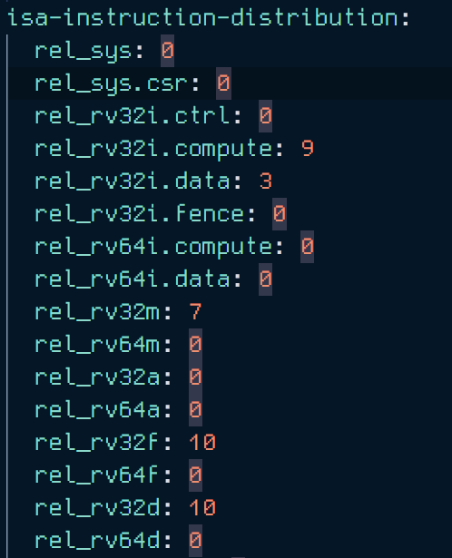
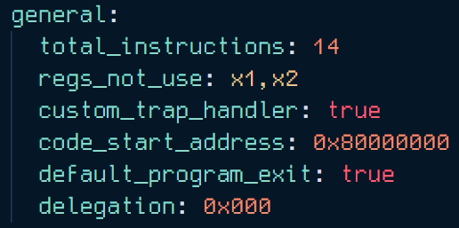
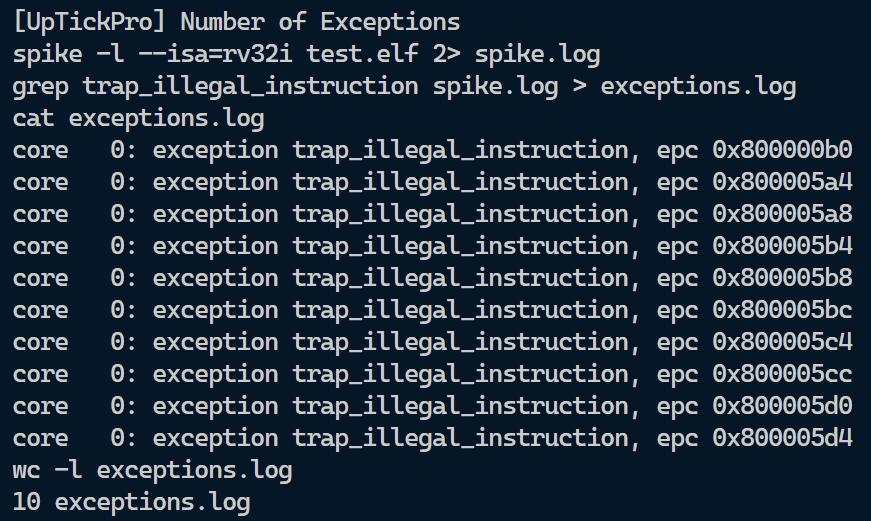

## Level 2 - Challenge 2 - Exceptions

In this challenge, AAPG (Automated Assembly Program Generation) tool is to be used, and a custom config file is to be generated such that the compilation results in at least 10 exceptions.

### Steps for achieving 10 or more Exceptions

- By going through the [wiki](https://gitlab.com/shaktiproject/tools/aapg/-/wikis/Wiki-AAPG-%5B2.2.2%5D#exceptions-and-program-macros), I found that exception generation is supported by means of various causes :- `ecause00` to `ecause14`. 
- An [older version of the wiki](https://gitlab.com/shaktiproject/tools/aapg/-/wikis/Wiki#exception-generation) revealed that `ecause02` stands for Illegal Exception.

- Hence the `ecause02` has been set to 1.

- The instruction distribution has also been changed because of 

- Furthermore, changes have been made to total no. of indtructions to make sure desired number of exceptions is achieved, also the `custom_trap_handler` has been enabled to make the program handle the exceptions, instead of simulation failing .

- Finally running the `Makefile` results in 10 exceptions.

