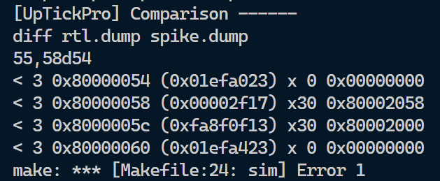
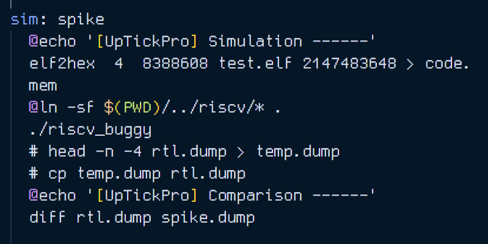

# Level 3 - Directed Test (Given Design)

In this challenge the aim was to alter either or both the `Makefile` & `test.S` to make sure the bugs in the design are caught. As explained below I have altered only the `Makefile` to expose the bugs.

## Error screenshot

## Observations

1. **Missing Lines**: The `diff` output shows that four lines are missing in the `spike.dump` when compared to the `rtl.dump`. These lines have addresses `0x80000054,` `0x80000058,` `0x8000005c,` and `0x80000060`.

2. **Address and Instruction Information**: The addresses `0x80000054` and instructions `0x01efa023` provide information about the program counter and the instructions being executed at those points in the simulation.

3. **Register Values**: Each line indicates change in values of the registers `x30` & `x0` after executing the corresponding instructions.

## Reason for Error

Upon further inspection I found that `spike.dump` is missing the last 4 lines from the `rtl.dump`. This indicates that some instructions tested on the RTL were not present in the `test.S` provided in the repo. Hence, if we want to resolve this issue (not the aim of this challenge) adding those instructions to our assembly test file would clear out the discrepancies between the dump files.

## How did test pass before ??

The reason due to which test was passing before edits were made to  the `Makefile` is that the `rtl.dump`, which is ideal test log, was being tampered with, by the replacing it with anohter file `temp.dump`. These commands are shown in below screenshot. A `temp.dump` is created by removing 4 lines from `rtl.dump`, then the contents of `rtl.dump` are replaced with `temp.dump`, thereby removing 4 lines from `rtl.dump`.

As shown these lines were commented out, to retain the originally intended ideal contents of `rtl.dump`.