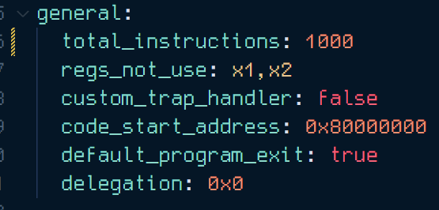
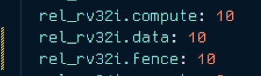
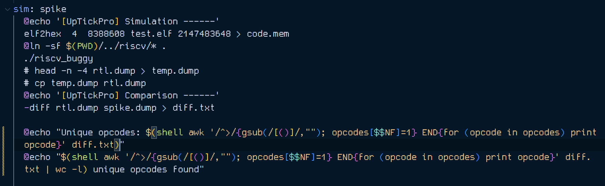

# Level 3 - Random Test (Given Design)

In this challenge the aim was to alter either or both the `Makefile` & `rv32i.yaml` to make sure the bugs in the design are caught. As explained below I have altered both these files to expose the bugs.

## Measures taken to produce errors

### YAML changes

The total number of instructions produced by AAPG tool was increased to 1000 to increase chances of catching bugs.

The instruction distribution was changed from only having compute instructions to now having fence and data instructions as well.

### MAKEFILE changes

The creation of `temp.dump` and it replacing `rtl.dump` both lines are commented out.

## Error screenshots and Observations

A total of 41 discrepancies have been caught in the following screenshots between `rtl.dump` & `spike.dump`

Based on the output of the `diff` command, we can analyze the differences between the `rtl.dump` and `spike.dump` files. Each line in the `diff` output represents a difference between the two files. Let's analyze each line:

1. `219c219`: This line indicates a change at line 219 of both files. The "c" stands for "changed," meaning that the content at this line is different in both files.

`< 3 0x80000734 (0x3dfeeb93) x23 0x5e3ea2a7`: This line shows the content of line 219 in `rtl.dump`. The values in parentheses represent the hexadecimal values of the instruction, register `x23`, and immediate value. The line indicates that in `spike.dump`, at address `0x80000734`, the instruction value is `0x3dfeeb93`, and register `x23` contains the value `0x5e3ea2a7`.

`> 3 0x80000734 (0x3dfeeb93) x23 0x5e3ea3ff`: This line shows the content of line 219 in `spike.dump`. The values in parentheses represent the hexadecimal values of the instruction, register `x23`, and immediate value. The line indicates that in `spike.dump`, at address `0x80000734`, the instruction value is `0x3dfeeb93`, and register `x23` contains the value `0x5e3ea3ff`.

**All the 41 errors are similar, same PC address, same instruction code, same registers just different outputs.**

