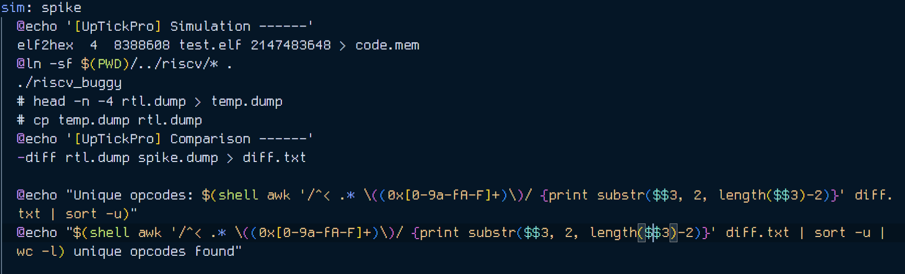
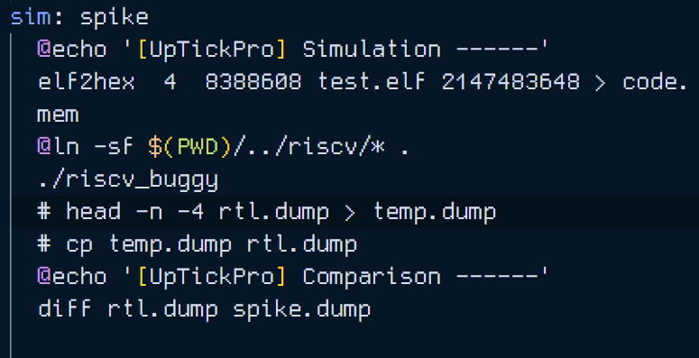
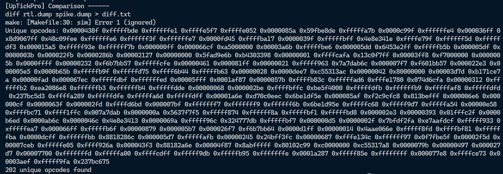

# Level 3 - Random Test (Given Design)

In this challenge the aim was to alter either or both the `Makefile` & `rv32i.yaml` to make sure the bugs in the design are caught. As explained below I have altered both these files to expose the bugs.

## Measures taken to produce errors

### YAML changes

The total number of instructions produced by AAPG tool was increased to 1000 to increase chances of catching bugs.


The instruction distribution was changed from only having compute instructions to now having fence and data instructions as well.


### MAKEFILE changes

The difference in the two dumps is analysed with the help of the `awk` utility. The counting of the unique opcodes lets us know the exact number of instructions whose implementation has been compromised in given design.



The creation of `temp.dump` and it replacing `rtl.dump` both lines are commented out.



## Error screenshots and Observations

There are changes in the output of the instructions. The opcodes of these instructions have been filtered out as shown in the screenshot.

**All 48 errors are similar, same PC address, same instruction code, same registers, just different outputs.**



The following is the output of command `diff rtl.dump spike.dump`

```
68c68
< 3 0x800004d8 (0x00976b33) x22 0xbdcb4292
---
> 3 0x800004d8 (0x00976b33) x22 0xfddb76b6
282c282
< 3 0x80000830 (0xa67b0893) x17 0xbdcb3cf9
---
> 3 0x80000830 (0xa67b0893) x17 0xfddb711d
292c292
< 3 0x80000858 (0x00a56933) x18 0x00000000
---
> 3 0x80000858 (0x00a56933) x18 0xffffbc11
320c320
< 3 0x800008c8 (0xa3f56a13) x20 0xdeb13a3f
---
> 3 0x800008c8 (0xa3f56a13) x20 0xfffffa3f
328,330c328,330
< 3 0x800008e8 (0xfd0de713) x14 0x90bb16e8
< 3 0x800008ec (0x1769e213) x 4 0x0000258e
< 3 0x800008f0 (0x01026a33) x20 0x0000258e
---
> 3 0x800008e8 (0xfd0de713) x14 0xfffffff8
> 3 0x800008ec (0x1769e213) x 4 0x000025fe
> 3 0x800008f0 (0x01026a33) x20 0x000025fe
342c342
< 3 0x80000920 (0x012f49b3) x19 0x00007185
---
> 3 0x80000920 (0x012f49b3) x19 0xffffcd94
344c344
< 3 0x80000928 (0x005b72b3) x 5 0x00000002
---
> 3 0x80000928 (0x005b72b3) x 5 0x00000026
391c391
< 3 0x800009e4 (0x006a1513) x10 0x00096380
---
> 3 0x800009e4 (0x006a1513) x10 0x00097f80
462c462
< 3 0x80000b00 (0xe2e56993) x19 0xfffffe51
---
> 3 0x80000b00 (0xe2e56993) x19 0xfffffe7f
504c504
< 3 0x80000ba8 (0x00d1e9b3) x19 0x7d60791b
---
> 3 0x80000ba8 (0x00d1e9b3) x19 0x7d60791f
631c631
< 3 0x80000da4 (0x4f893e13) x28 0x00000001
---
> 3 0x80000da4 (0x4f893e13) x28 0x00000000
668c668
< 3 0x80000e38 (0x00e06433) x 8 0x90bb16e8
---
> 3 0x80000e38 (0x00e06433) x 8 0xfffffff8
673c673
< 3 0x80000e4c (0x00075513) x10 0x90bb16e8
---
> 3 0x80000e4c (0x00075513) x10 0xfffffff8
744c744
< 3 0x80000f68 (0x003759b3) x19 0x00000121
---
> 3 0x80000f68 (0x003759b3) x19 0x000001ff
799c799
< 3 0x80001044 (0x99b66413) x 8 0xfffff968
---
> 3 0x80001044 (0x99b66413) x 8 0xfffff9fb
837c837
< 3 0x800010dc (0x01895933) x18 0x00000000
---
> 3 0x800010dc (0x01895933) x18 0xffffbc11
863c863
< 3 0x80001144 (0xf545ea93) x21 0xffff9c51
---
> 3 0x80001144 (0xf545ea93) x21 0xffffff55
905c905
< 3 0x800011ec (0x015fefb3) x31 0xd5ce6d9e
---
> 3 0x800011ec (0x015fefb3) x31 0xffffffdf
1007c1007
< 3 0x80001384 (0x012302b3) x 5 0x00002920
---
> 3 0x80001384 (0x012302b3) x 5 0xffffe531
1087c1087
< 3 0x800014c4 (0x00990fb3) x31 0x00000012
---
> 3 0x800014c4 (0x00990fb3) x31 0xffffbc23
1119c1119
< 3 0x80001544 (0xb887e513) x10 0xfffffbf4
---
> 3 0x80001544 (0xb887e513) x10 0xfffffbfc
1182c1182
< 3 0x80001640 (0x012dc5b3) x11 0x4f770000
---
> 3 0x80001640 (0x012dc5b3) x11 0xb088bc11
1191c1191
< 3 0x80001664 (0x01346433) x 8 0x00000051
---
> 3 0x80001664 (0x01346433) x 8 0x000000fb
1205c1205
< 3 0x8000169c (0xaab5a413) x 8 0x00000000
---
> 3 0x8000169c (0xaab5a413) x 8 0x00000001
1223c1223
< 3 0x800016e4 (0x00a461b3) x 3 0x00002a60
---
> 3 0x800016e4 (0x00a461b3) x 3 0x00002a61
1268c1268
< 3 0x80001798 (0x747de993) x19 0x00000755
---
> 3 0x80001798 (0x747de993) x19 0x00000757
1298c1298
< 3 0x80001810 (0x92256993) x19 0x00001f38
---
> 3 0x80001810 (0x92256993) x19 0xffffff3a
1313,1314c1313,1314
< 3 0x8000184c (0xea69c493) x 9 0xffffe19e
< 3 0x80001850 (0x0089b9b3) x19 0x00000001
---
> 3 0x8000184c (0xea69c493) x 9 0x0000019c
> 3 0x80001850 (0x0089b9b3) x19 0x00000000
1318c1318
< 3 0x80001860 (0x008981b3) x 3 0x0000894a
---
> 3 0x80001860 (0x008981b3) x 3 0x00008949
1321c1321
< 3 0x8000186c (0xc5856a13) x20 0x00001a42
---
> 3 0x8000186c (0xc5856a13) x20 0xfffffe5a
1330c1330
< 3 0x80001890 (0xdc546513) x10 0xfffffd72
---
> 3 0x80001890 (0xdc546513) x10 0xfffffdf7
1337c1337
< 3 0x800018ac (0x1e5d6e13) x28 0x000001e4
---
> 3 0x800018ac (0x1e5d6e13) x28 0x000001e5
1339c1339
< 3 0x800018b4 (0x00ba1533) x10 0x0000d210
---
> 3 0x800018b4 (0x00ba1533) x10 0xfffff2d0
1354c1354
< 3 0x800018f0 (0xa2d66e93) x29 0xfffffa2c
---
> 3 0x800018f0 (0xa2d66e93) x29 0xfffffa2d
1363c1363
< 3 0x80001914 (0x01f19cb3) x25 0x000894a0
---
> 3 0x80001914 (0x01f19cb3) x25 0x00089490
1371,1374d1370
< 3 0x80001934 (0x01efa023) x 0 0x00000000
< 3 0x80001938 (0x00093f17) x30 0x80094938
< 3 0x8000193c (0x6c8f0f13) x30 0x80095000
< 3 0x80001940 (0x01efa423) x 0 0x00000000
```