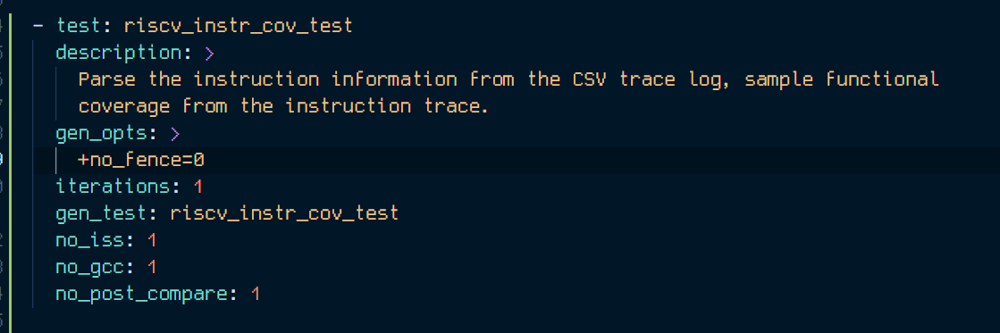
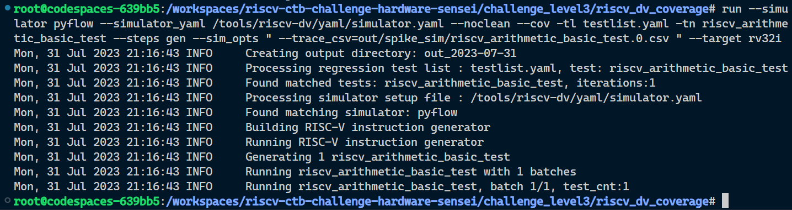

# RISCV-DV

Test generation using riscv-dv

```
run --simulator pyflow --simulator_yaml /tools/riscv-dv/yaml/simulator.yaml --noclean --so --cov -tl testlist.yaml -tn riscv_arithmetic_basic_test --steps gen --sim_opts " --trace_csv=out/spike_sim/riscv_arithmetic_basic_test.0.csv " --target rv32i
```

Edited the testlist to include `riscv_instr_cov_test`



The arithmetic basic test passes.

